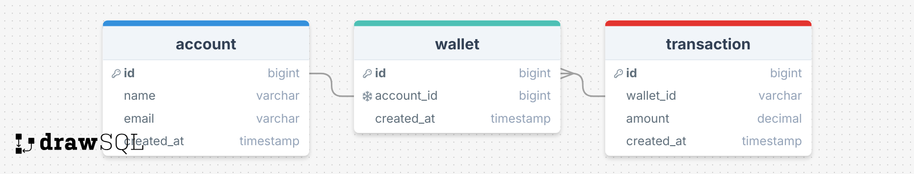

# wallet-service-assignment

Wallet service that manages users money.

## Technical decisions
The app is a REST API that represents transaction operations in the client's wallet.

Endpoints were created to view the data and help visualize the data retrieved from the database.

The solution design takes into account that each account has a wallet and possible transactions.
When creating an account, a wallet is created together.
Each transaction is recorded, in order to calculate the client's funds, thus enabling a historical view of the funds.
When starting the application, by choice, the entire database is deleted. I did this to make testing easier. If this is a nuisance, the data deletion can be quickly removed.

About the code base: I use as few libraries as possible.
No libraries, such as ORMs, were used in an attempt to maintain the simplicity and flexibility of the solution.

Here is the database model:



---

## Tools

Below is a list of the main tools used in development:

- [Java](https://www.java.com) - Programming language.
- [Spring](https://spring.io) - Spring is an open source software development framework for Java that allows you to create applications.
- [Junit](https://kotlinlang.org/api/core/kotlin-test/) - Test library.
- [Hikari](https://github.com/brettwooldridge/HikariCP) - JDBC connection pool.
- [Postgresql](https://jdbc.postgresql.org/) - Open source JDBC driver for PostgresSql database.
- [Gradle](https://gradle.org/) - Build tool.

---

## Running the application and useful commands
Java must be installed and added to the environment variables for Gradle to work properly.
To upload the instance with the database, run the command below.

__Attention! This step is necessary to run the application and is part of the test suite.__
```console
docker-compose up
```

Run the application:

```console
./gradlew run
```

Run test suite:

```console
./gradlew test
```

Build:

```console
./gradlew build
```

Or if you prefer, run the above commands via IDE

---

## Collections
In the collections folder, located at the root of the project, there are collections of the Bruno and Postman software.
Below are the cURL commands:

Recover Wallets
```console
curl --request GET \
  --url http://127.0.0.1:8080/wallet/
```

Recover Users
```console
curl --request GET \
  --url http://127.0.0.1:8080/user/
```

Create User
```console
curl --request POST \
  --url http://127.0.0.1:8080/user/ \
  --data '{
  "name": "Neto",
  "email": "neto@gmail.com"
}'
```

Recover Transactions
```console
curl --request GET \
  --url http://127.0.0.1:8080/wallet/transaction/
```

Create Transaction
```console
curl --request POST \
  --url http://127.0.0.1:8080/wallet/transaction/ \
  --data '{
  "user_id": 1,
  "amount": 10
}'
```

Recover Balance
```console
curl --request GET \
  --url 'http://127.0.0.1:8080/wallet/balance/?user_id=1'
```

Recover Historical Balance
```console
curl --request GET \
  --url 'http://127.0.0.1:8080/wallet/balance/?user_id=1&init_date=01%2F04%2F2025&end_date=03%2F04%2F2025'
```

Transfer Founds
```console
curl --request POST \
  --url http://127.0.0.1:8080/wallet/transfer/ \
  --data '{
  "start_user_id": 1,
  "destination_user_id": 2,
  "amount": 5
}'
```
